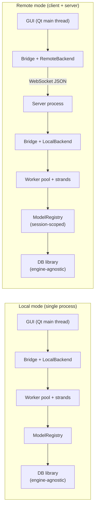
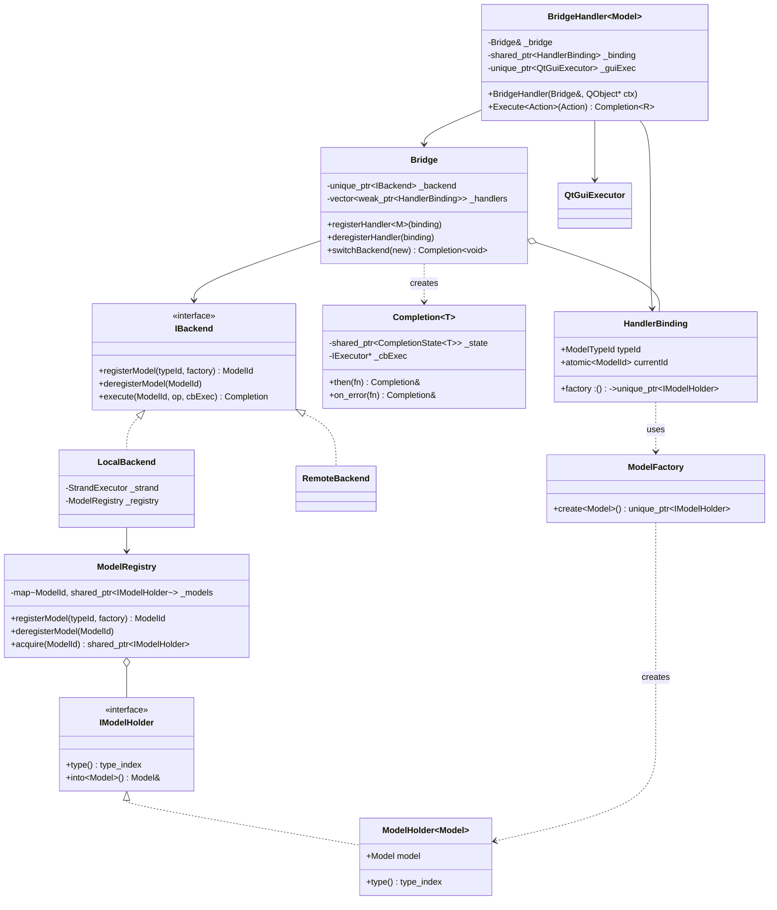

# Bridge / Model / Executor Architecture

**Status:** Design draft
**Audience:** Engineers implementing or reviewing the GUI-to-Model bridge layer
**Last updated:** 2026-04-24

---

## 1. Context

A Qt-based GUI needs to invoke actions on business-object models. Those models may live:

- **In the same process** as the GUI (local mode), backed by a database connection from our engine-agnostic DB library, or
- **In a remote server process** (remote mode), reached over a network. The server itself is built from the same Bridge / Model / Executor architecture as local mode — just wired to a network transport instead of directly to a GUI.

We want a small, typed asynchronous bridge with these properties:

- Typed per-model handles in the GUI (`BridgeHandler<Model>`).
- Actions execute off the GUI thread (locally on a worker pool, or remotely on the server's worker pool).
- Results/errors are delivered back on the Qt main thread, safely tied to the lifetime of a `QObject` receiver.
- Non-concurrency-savvy developers can author `Model` classes without writing locks.
- The async machinery (futures, coroutines, transports) is hidden behind a stable public API so it can be replaced later.
- The underlying backend (local DB connection or remote server endpoint) can be switched at runtime without destroying existing `BridgeHandler`s.

## 2. Goals / Non-goals

**Goals**

- Stable public API: `Bridge`, `BridgeHandler<Model>`, `Completion<T>`.
- One GUI code path regardless of whether the backend is local or remote.
- Thread safety for model authors without them having to think about it (strand-per-model serialization).
- Correct behavior when the GUI receiver dies mid-action (result is silently dropped).
- Exceptions thrown by an action flow to `.on_error()` on the GUI thread; network and transport errors appear through the same channel.
- Orphaned exceptions (no `.on_error()` attached, no `.then()` attached) are logged, not swallowed.
- Runtime backend switch fails in-flight work with a clear error and transparently rebinds handlers to the new backend.
- Server pluggable session scope (per-connection / per-user / shared) chosen once at server startup.
- Qt is the default GUI and transport, but both are hidden behind interfaces so a non-Qt build is possible.

**Non-goals**

- `when_all` / `when_any` combinators (can be added later).
- Exposing coroutine `co_await` on `Completion` to application code.
- Any dependency on Boost in v1 — reserved as a fallback if the bespoke `Task<T>` proves insufficient.
- Cross-connection collaboration / server push events in v1 (the WebSocket transport leaves room for them, but they are not wired up initially).

## 3. Deployment topologies



The GUI is oblivious to which topology is active — it always sees `Bridge`, `BridgeHandler`, `Completion`. The only thing that changes between topologies is which `IBackend` implementation the `Bridge` is constructed with.

## 4. Layered architecture

```mermaid
flowchart TB
    subgraph GUI["Application / GUI (Qt main thread)"]
        BH["BridgeHandler&lt;Model&gt;<br/>owns QObject* guiCtx"]
    end

    subgraph Public["Public API (stable signatures)"]
        B["Bridge"]
        C["Completion&lt;T&gt;"]
    end

    subgraph Backends["Backend abstraction"]
        IB["IBackend"]
        LB["LocalBackend<br/>(strand pool + registry + DB)"]
        RB["RemoteBackend<br/>(WebSocket + JSON codec)"]
    end

    subgraph Internal["Internal async core (swappable impl)"]
        T["Task&lt;T&gt;<br/>(coroutine)"]
        IE["IExecutor"]
        TP["ThreadPoolExecutor"]
        SE["StrandExecutor<br/>(serializes per ModelId)"]
        QE["QtGuiExecutor<br/>(QMetaObject::invokeMethod)"]
        WS["QtWebSocketTransport"]
    end

    BH -->|Execute&lt;Action&gt;| B
    B -.returns.-> C
    BH --> QE
    B --> IB
    IB -.implemented by.-> LB
    IB -.implemented by.-> RB
    LB --> SE
    LB --> Reg["ModelRegistry"]
    SE --> TP
    LB -.schedules.-> T
    RB --> WS
    C -.callbacks via.-> QE
    IE <|.. TP
    IE <|.. QE
```

Four layers:

1. **Public API** (`Bridge`, `BridgeHandler`, `Completion`) — what callers see. Stable.
2. **Backend abstraction** (`IBackend` + two impls) — this is the seam the mode switch rides on.
3. **Executor interfaces** — "run this callable somewhere" abstraction; stays the same across modes.
4. **`Task<T>`** — coroutine-backed result capture. Strictly internal.

## 5. Request flow — local mode

```mermaid
sequenceDiagram
    autonumber
    participant GUI as GUI code
    participant BH as BridgeHandler&lt;Model&gt;
    participant B as Bridge
    participant LB as LocalBackend
    participant R as ModelRegistry
    participant S as StrandExecutor
    participant W as Worker thread
    participant Q as QtGuiExecutor

    GUI->>BH: handler.Execute(action)
    BH->>B: executeAction(id, action, guiExec)
    B->>LB: executeAction(id, action, guiExec)
    LB->>R: acquire(id) -> shared_ptr&lt;IModelHolder&gt;
    LB->>S: post(id, taskLambda)
    LB-->>BH: Completion&lt;T&gt;
    BH-->>GUI: Completion&lt;T&gt;
    GUI->>GUI: .then(onOk).on_error(onErr)

    Note over S,W: Later, on a worker thread<br/>(serialized per ModelId)
    S->>W: run taskLambda
    W->>W: Model& m = holder.into&lt;Model&gt;()
    W->>W: Task&lt;T&gt;: co_return m.Execute(action)
    alt action succeeded
        W->>Q: post(dispatch onOk(result))
        Q->>GUI: (main thread) onOk(result)
    else action threw
        W->>Q: post(dispatch onErr(eptr))
        Q->>GUI: (main thread) onErr(eptr)
    end
```

## 6. Request flow — remote mode

```mermaid
sequenceDiagram
    autonumber
    participant GUI as GUI code
    participant BH as BridgeHandler&lt;Model&gt;
    participant B as Bridge
    participant RB as RemoteBackend (client)
    participant WSC as WebSocket (client)
    participant WSS as WebSocket (server)
    participant SRV as Server Bridge+LocalBackend
    participant Q as QtGuiExecutor

    GUI->>BH: handler.Execute(action)
    BH->>B: executeAction(id, action, guiExec)
    B->>RB: executeAction(id, action, guiExec)
    RB->>RB: serialize(Action) -> JSON, assign reqId
    RB->>WSC: send {"type":"execute","reqId":N,"modelId":...,"action":...}
    WSC->>WSS: frame
    WSS->>SRV: dispatch(reqId, modelId, action)
    SRV->>SRV: LocalBackend runs action (as in §5)
    alt success
        SRV->>WSS: {"type":"result","reqId":N,"value":...}
    else failure
        SRV->>WSS: {"type":"error","reqId":N,"error":{...}}
    end
    WSS->>WSC: frame
    WSC->>RB: on-message
    RB->>RB: parse JSON, look up reqId, set state
    RB->>Q: post(dispatch onOk/onErr)
    Q->>GUI: (main thread) callback fires
```

The server runs the **same** Bridge/LocalBackend as §5 — the server's `Bridge` just uses a `WebSocketReplyExecutor` as the callback executor (to write results back out on the socket) instead of a `QtGuiExecutor`. Symmetric architecture, zero duplicated logic.

## 7. Class relationships



Two things this diagram is careful about:

- **`HandlerBinding`** lets handlers survive a backend switch: the `Bridge` tracks all live bindings and, on `switchBackend`, re-registers each one with the new backend and updates its `currentId` atomically. The captured `factory` is what the backend uses to reconstruct a `ModelHolder<Model>` after the switch.
- **`IModelHolder` / `ModelHolder<Model>` / `ModelFactory`** form the type-erasure layer that lets `ModelRegistry` store heterogeneous model types behind a single pointer. `into<Model>()` is the typed escape hatch — a debug-assert checks `type_index` before the cast, release is a single `static_cast`.

## 8. Public API

```cpp
struct ModelId { UUID value; };
struct ModelTypeId { std::string value; };   // e.g. "CustomerModel"

template<typename T>
class Completion {
public:
    Completion& then(std::function<void(T)> onOk);
    Completion& on_error(std::function<void(std::exception_ptr)> onErr);

    Completion(Completion&&) noexcept = default;
    Completion& operator=(Completion&&) noexcept = default;
    Completion(const Completion&) = delete;
    Completion& operator=(const Completion&) = delete;

    ~Completion();   // logs unhandled exception if error AND no on_error

private:
    friend class Bridge;
    std::shared_ptr<detail::CompletionState<T>> _state;
    IExecutor* _cbExec;
};

class Bridge {
public:
    explicit Bridge(std::unique_ptr<IBackend> backend);

    // Runtime backend switch. All in-flight completions fail with
    // BackendSwitched; all live handlers are re-registered on the new backend.
    // Returned Completion<void> fires once every handler has been rebound.
    Completion<void> switchBackend(std::unique_ptr<IBackend> newBackend);

private:
    // internal registration hooks, used by BridgeHandler
    template<typename Model>
    std::shared_ptr<HandlerBinding> registerHandler(IExecutor* cbExec);
    void deregisterHandler(std::shared_ptr<HandlerBinding>);

    std::unique_ptr<IBackend>                           _backend;
    std::mutex                                          _mtx;
    std::vector<std::weak_ptr<HandlerBinding>>          _handlers;
};

template<typename Model>
class BridgeHandler {
public:
    BridgeHandler(Bridge& b, QObject* guiContext)
        : _bridge{b}
        , _guiExec{std::make_unique<QtGuiExecutor>(guiContext)}
        , _binding{b.registerHandler<Model>(_guiExec.get())}
    {}
    ~BridgeHandler() { _bridge.deregisterHandler(_binding); }

    template<typename Action>
    Completion<typename Action::ReturnType> Execute(Action a) {
        return _bridge.template executeVia<Model, Action>(
            _binding, std::move(a), _guiExec.get());
    }

private:
    Bridge&                              _bridge;
    std::unique_ptr<QtGuiExecutor>       _guiExec;
    std::shared_ptr<HandlerBinding>      _binding;
};
```

### Typical call site (identical regardless of mode)

```cpp
Bridge bridge{std::make_unique<LocalBackend>(dbConn, threadPool)};
// or: Bridge bridge{std::make_unique<RemoteBackend>(wsClient)};

BridgeHandler<CustomerModel> handler{bridge, this /* QObject receiver */};

handler.Execute(LoadCustomersAction{.page = 1})
    .then([this](std::vector<Customer> rows) { populateTable(rows); })
    .on_error([this](std::exception_ptr e) { showError(e); });
```

## 9. Backend abstraction

### 9.1 Model storage: `IModelHolder`, `ModelHolder<T>`, `ModelFactory`

`ModelRegistry` needs to store heterogeneous model types behind a single pointer. The `IModelHolder` interface plus its `ModelHolder<T>` templates form the type-erasure layer; `ModelFactory` is the single choke-point that knows how to construct the right holder for a given `Model`.

```cpp
struct IModelHolder {
    virtual ~IModelHolder() = default;
    virtual std::type_index type() const noexcept = 0;

    // Typed escape hatch. Debug builds assert on type mismatch; release is
    // a single static_cast. Callers that built BridgeHandler<Model> with
    // the same Model type always satisfy this.
    template<typename Model>
    Model& into() {
        assert(type() == std::type_index(typeid(Model)));
        return static_cast<ModelHolder<Model>*>(this)->model;
    }
};

template<typename Model>
struct ModelHolder : IModelHolder {
    Model model;

    template<typename... Args>
    explicit ModelHolder(Args&&... args)
        : model{std::forward<Args>(args)...} {}

    std::type_index type() const noexcept override { return typeid(Model); }
};

class ModelFactory {
public:
    // Extend (or add overloads) when Model constructors take non-default
    // arguments such as a DB connection supplied by the backend.
    template<typename Model>
    static std::unique_ptr<IModelHolder> create() {
        return std::make_unique<ModelHolder<Model>>();
    }
};
```

`ModelRegistry` stores `shared_ptr<IModelHolder>` (not `unique_ptr`, even though `ModelFactory::create` returns `unique_ptr`, which converts implicitly). Shared ownership is what lets a deregistered model stay alive for pending actions — strand tasks capture the `shared_ptr` before running.

```cpp
class ModelRegistry {
public:
    ModelId registerModel(ModelTypeId,
                          std::function<std::unique_ptr<IModelHolder>()> factory);
    void    deregisterModel(ModelId);
    std::shared_ptr<IModelHolder> acquire(ModelId);

private:
    std::mutex                                                           _mtx;
    std::unordered_map<ModelId, std::shared_ptr<IModelHolder>>           _models;
    std::atomic<uint64_t>                                                _next{0};
};
```

### 9.2 `IBackend` interface

```cpp
struct IBackend {
    virtual ~IBackend() = default;

    // The factory is consulted by LocalBackend to construct the holder
    // in-process. RemoteBackend ignores it and uses typeId to ask the
    // server to construct the model remotely.
    virtual ModelId registerModel(
        ModelTypeId,
        std::function<std::unique_ptr<IModelHolder>()> factory) = 0;

    virtual void deregisterModel(ModelId) = 0;

    // Type-erased action call: receives the model via IModelHolder and
    // recovers the concrete type via .into<Model>() at the call site.
    // RemoteBackend replaces `op` with a serialize/deserialize round-trip
    // (see §11) — the interface is the same shape on both ends.
    virtual Completion<std::shared_ptr<void>> execute(
        ModelId,
        std::function<std::shared_ptr<void>(IModelHolder&)> op,
        IExecutor* cbExec) = 0;
};
```

The public `Bridge::executeVia<Model, Action>` is where the (Model, Action) pair is type-erased and un-erased:

```cpp
template<typename Model, typename Action>
Completion<typename Action::ReturnType>
Bridge::executeVia(std::shared_ptr<HandlerBinding> binding,
                   Action a, IExecutor* cbExec)
{
    using R = typename Action::ReturnType;

    auto op = [a = std::move(a)](IModelHolder& holder) mutable
              -> std::shared_ptr<void>
    {
        Model& m = holder.into<Model>();
        return std::make_shared<R>(m.Execute(a));
    };

    return _backend->execute(binding->currentId.load(),
                             std::move(op), cbExec)
           .map([](std::shared_ptr<void> v) -> R {
                return std::move(*static_cast<R*>(v.get()));
           });
    // .map is internal, not exposed on Completion publicly.
}
```

For remote mode, `RemoteBackend::execute` replaces the `op` callable with a `(ModelTypeId, ActionTypeId, SerializedAction)` tuple, serializes it via `ActionTraits<A>::toJson`, ships it over the WebSocket, and deserializes the result via `ActionTraits<A>::resultFromJson` back into the returned `shared_ptr<void>`. See §11.

### 9.3 `LocalBackend`

```cpp
class LocalBackend : public IBackend {
public:
    LocalBackend(db::Connection& dbConn, IExecutor& workerPool);

    ModelId registerModel(ModelTypeId,
                          std::function<std::unique_ptr<IModelHolder>()> factory) override;
    void    deregisterModel(ModelId) override;
    Completion<std::shared_ptr<void>> execute(
        ModelId, std::function<std::shared_ptr<void>(IModelHolder&)> op,
        IExecutor* cbExec) override;

private:
    db::Connection&                    _db;   // supplied by DB library
    StrandExecutor                     _strand;
    ModelRegistry                      _registry;
};
```

`registerModel` asks the `ModelRegistry` to call `factory()` (which is `[]{ return ModelFactory::create<Model>(); }` closed over at the `Bridge::registerHandler<Model>` site). `execute` acquires the `shared_ptr<IModelHolder>`, posts a strand task that runs `op(*holder)` inside a `Task<T>` coroutine (for automatic exception capture), and delivers success/failure through the returned `Completion`.

### 9.4 `RemoteBackend`

```cpp
class RemoteBackend : public IBackend {
public:
    explicit RemoteBackend(std::unique_ptr<IWebSocketClient>);

    ModelId registerModel(ModelTypeId,
                          std::function<std::unique_ptr<IModelHolder>()> factory) override;
    void    deregisterModel(ModelId) override;
    Completion<std::shared_ptr<void>> execute(
        ModelId,
        std::function<std::shared_ptr<void>(IModelHolder&)> op,
        IExecutor* cbExec) override;

private:
    std::unique_ptr<IWebSocketClient>                              _ws;
    std::atomic<uint64_t>                                          _nextReqId;
    std::mutex                                                     _pendingMtx;
    std::unordered_map<uint64_t, PendingRequest>                   _pending;
    // PendingRequest = { shared_ptr<CompletionState<shared_ptr<void>>>; IExecutor* cb; }
};

struct IWebSocketClient {
    virtual ~IWebSocketClient() = default;
    virtual void connect(QUrl) = 0;
    virtual void send(std::string json) = 0;
    virtual void setOnMessage(std::function<void(std::string)>) = 0;
    virtual void setOnClose(std::function<void(CloseReason)>) = 0;
};
```

Default implementation is `QtWebSocketClient` (wraps `QWebSocket`). Because `IWebSocketClient` is a pure interface, a non-Qt build provides its own implementation (Boost.Beast, standalone Asio, etc.) and nothing above the interface changes.

**Note on the `op` parameter.** `RemoteBackend::execute` receives the same `op` callable that `LocalBackend` does, but can't invoke it directly — the underlying `IModelHolder` lives on the other end of the wire. In practice `Bridge::executeVia<Model, Action>` also attaches `ActionTraits<Action>` metadata (typeId, `toJson(a)`, `resultFromJson(v)`) to the request via a small sidecar struct, and `RemoteBackend` uses those to serialize/deserialize. `LocalBackend` ignores the sidecar and uses `op` directly. The same `Bridge::executeVia` code path works for both.

## 10. Internal async core (unchanged from the earlier local-only design)

### 10.1 `IExecutor` and friends

```cpp
struct IExecutor {
    virtual ~IExecutor() = default;
    virtual void post(std::function<void()> fn) = 0;
};

class ThreadPoolExecutor : public IExecutor { /* N worker threads, MPMC queue */ };

class StrandExecutor {
public:
    explicit StrandExecutor(IExecutor& base);
    void post(ModelId key, std::function<void()> fn);

private:
    struct Strand {
        std::mutex                         mtx;
        std::queue<std::function<void()>>  pending;
        bool                               running = false;
    };
    IExecutor&                                           _base;
    std::mutex                                           _mapMtx;
    std::unordered_map<ModelId, std::shared_ptr<Strand>> _strands;
};

class QtGuiExecutor : public IExecutor {
public:
    explicit QtGuiExecutor(QObject* receiver) : _r{receiver} {}
    void post(std::function<void()> fn) override {
        QMetaObject::invokeMethod(_r, std::move(fn), Qt::QueuedConnection);
    }
private:
    QPointer<QObject> _r;
};
```

### 10.2 `Task<T>` (coroutine primitive)

```cpp
namespace detail {

template<typename T>
struct TaskState {
    std::mutex                                mtx;
    std::optional<T>                          value;
    std::exception_ptr                        error;
    bool                                      ready = false;
    std::function<void(TaskState&)>           continuation;

    void set_value(T v);
    void set_exception(std::exception_ptr e);
    void attach(std::function<void(TaskState&)> cb);
};

template<typename T>
class Task {
public:
    struct promise_type {
        std::shared_ptr<TaskState<T>> state = std::make_shared<TaskState<T>>();
        Task get_return_object() { return Task{state}; }
        std::suspend_never initial_suspend() noexcept { return {}; }
        std::suspend_never final_suspend()   noexcept { return {}; }
        void return_value(T v)     { state->set_value(std::move(v)); }
        void unhandled_exception() { state->set_exception(std::current_exception()); }
    };
    std::shared_ptr<TaskState<T>> state() const { return _state; }
private:
    explicit Task(std::shared_ptr<TaskState<T>> s) : _state{std::move(s)} {}
    std::shared_ptr<TaskState<T>> _state;
};

}  // namespace detail
```

## 11. Network protocol

### 11.1 Message envelope

All messages are JSON, one per WebSocket text frame. Every message has a `type` and, for request/response pairs, a `reqId`.

```json
// client -> server: register a model
{ "type": "register", "reqId": 1, "modelType": "CustomerModel" }

// server -> client: registration result
{ "type": "registered", "reqId": 1, "modelId": "d1e2…" }

// client -> server: run an action
{ "type": "execute", "reqId": 42,
  "modelId": "d1e2…", "modelType": "CustomerModel",
  "actionType": "LoadCustomers",
  "action": { "page": 1 } }

// server -> client: success
{ "type": "result", "reqId": 42, "value": { "rows": [ ... ] } }

// server -> client: failure
{ "type": "error", "reqId": 42,
  "error": { "code": "DB_TIMEOUT", "message": "…",
             "type": "DbError" } }

// client -> server: deregister
{ "type": "deregister", "modelId": "d1e2…" }

// server -> client: connection policy info (sent on connect)
{ "type": "hello", "sessionPolicy": "per-connection",
  "protocolVersion": 1 }
```

Errors carry a canonical `code` and a logical `type` tag so the client can rebuild a typed exception before calling `.on_error(exception_ptr)`. A small `ErrorRegistry` on the client maps `"DbError"` to a factory that reconstructs `DbError` from the JSON payload.

### 11.2 Action serialization traits

Actions and Models declare their wire contract via traits:

```cpp
template<> struct ModelTraits<CustomerModel> {
    static constexpr auto typeId() { return ModelTypeId{"CustomerModel"}; }
};

template<> struct ActionTraits<LoadCustomersAction> {
    using Result = std::vector<Customer>;

    static constexpr auto typeId() { return ActionTypeId{"LoadCustomers"}; }
    static json toJson(const LoadCustomersAction&);
    static LoadCustomersAction fromJson(const json&);
    static json resultToJson(const Result&);
    static Result resultFromJson(const json&);
};
```

A `REGISTER_ACTION(CustomerModel, LoadCustomersAction)` macro wires the server's `ActionDispatcher` at static-init time so actions are dispatched purely by `(modelType, actionType)` strings on the wire.

### 11.3 Handshake and reconnection

On `connect`, the server sends a `hello` message with the configured session policy and protocol version. The client validates the version and stashes the policy so it knows whether reconnects will recover existing models (per-user) or not (per-connection).

Reconnection behavior follows the same rule as a manual backend switch: in-flight requests fail with `BackendSwitched`, all live handlers are re-registered on the new socket.

## 12. Server composition

```mermaid
flowchart TB
    subgraph Server["Server process"]
        Listener["WebSocket listener<br/>(QWebSocketServer or alt)"]
        Policy["ISessionPolicy<br/>(PerConnection | PerUser | Shared)"]
        subgraph Session["Per-connection session"]
            Reader["Message reader"]
            ReplyExec["WebSocketReplyExecutor<br/>(writes results out)"]
            B["Bridge + LocalBackend"]
            B --> Strand["StrandExecutor"]
            Strand --> Pool["ThreadPoolExecutor"]
            B --> Reg["ModelRegistry<br/>(obtained from policy)"]
        end
        Listener -->|new connection| Policy
        Policy -->|registryFor(ctx)| Reg
        Listener --> Session
        Reader --> B
        B --> ReplyExec
    end
```

### 12.1 `ISessionPolicy`

```cpp
struct ConnectionContext {
    ConnectionId         id;
    std::optional<UserId> authenticatedUser;
    QUrl                 url;
    QList<QPair<QString,QString>> headers;
};

struct ISessionPolicy {
    virtual ~ISessionPolicy() = default;
    virtual std::shared_ptr<ModelRegistry> registryFor(ConnectionContext&) = 0;
    virtual void onConnectionClosed(ConnectionContext&) = 0;
};

// Shipped implementations:
class PerConnectionPolicy : public ISessionPolicy { /* fresh registry each time */ };
class PerUserPolicy       : public ISessionPolicy { /* registry per UserId */ };
class SharedPolicy        : public ISessionPolicy { /* single registry */ };
```

The policy is chosen once at server startup from config; the `Server` class constructs one instance and consults it on every connect/disconnect. Custom policies can be plugged in by implementing the interface.

### 12.2 `WebSocketReplyExecutor`

The server's `Bridge` uses this as the callback executor instead of `QtGuiExecutor`:

```cpp
class WebSocketReplyExecutor : public IExecutor {
public:
    explicit WebSocketReplyExecutor(std::weak_ptr<Session> s);
    void post(std::function<void()> fn) override {
        if (auto s = _session.lock()) s->runOnWriterThread(std::move(fn));
    }
private:
    std::weak_ptr<Session> _session;
};
```

If the session is gone (client disconnected), the `weak_ptr` is empty and the callback is silently dropped — symmetric to how `QPointer<QObject>` on the client drops orphan results.

## 13. Runtime backend switching

### 13.1 Switch flow

```mermaid
sequenceDiagram
    autonumber
    participant App as App code
    participant B as Bridge
    participant Old as Old IBackend
    participant New as New IBackend
    participant H1 as HandlerBinding #1
    participant H2 as HandlerBinding #2

    App->>B: switchBackend(newBackend)
    B->>B: mark state = Switching;<br/>store newBackend
    B->>Old: fail all in-flight with BackendSwitched
    Note over B: New Execute calls queue<br/>on each HandlerBinding
    B->>New: registerModel(H1.typeId) -> Completion&lt;ModelId&gt;
    B->>New: registerModel(H2.typeId) -> Completion&lt;ModelId&gt;
    par per handler
        New-->>B: id1
        B->>H1: currentId.store(id1); drain queue
    and
        New-->>B: id2
        B->>H2: currentId.store(id2); drain queue
    end
    B->>Old: destroy
    B->>B: state = Ready
    B-->>App: Completion&lt;void&gt; (all handlers rebound)
```

### 13.2 Semantic contract

- In-flight completions already dispatched to the old backend are failed with a `BackendSwitched` exception. Callers receive it through their existing `.on_error()` handler on the GUI thread.
- `Execute()` calls made *during* the switch window queue on the handler's binding and fire against the new backend once its `ModelId` is resolved.
- If re-registration on the new backend fails for any handler, that specific handler is marked invalid (its `HandlerBinding::currentId` becomes `INVALID`), and all future calls on it fail with `HandlerNotRebound`. The global switch still completes for the handlers that succeeded.
- `switchBackend` is idempotent-ish: a second call before the first completes waits on the first (no parallel switches).
- Because the public API is unchanged across modes, switching from `LocalBackend` to `RemoteBackend` or vice versa is just a different argument to `switchBackend` — GUI code doesn't have to know.

### 13.3 Trigger surfaces

The app exposes its own commands:

```cpp
bridge.switchBackend(std::make_unique<LocalBackend>(newDbConn, pool));
bridge.switchBackend(std::make_unique<RemoteBackend>(makeWsClient("wss://new-server")));
```

The DB library provides the `db::Connection` for local switches; the WebSocket client factory is a small Qt helper (with a non-Qt equivalent available if needed).

## 14. Key design decisions

| Decision | Chosen | Why |
|---|---|---|
| Executor model | Thread pool + strand per `ModelId` | Parallelism across models, serialization within a model. Removes the need for `Model` authors to write thread-safe code. |
| Error channel | Exceptions captured + `.on_error(exception_ptr)` hook | Idiomatic C++; matches `std::future::get()` rethrow. Users can `try/catch` whatever type they care about. Transport/network errors reuse the same channel. |
| Callback thread | Marshalled to Qt main thread by default via `QMetaObject::invokeMethod` | `BridgeHandler` is explicitly a GUI-side object; Qt widgets are main-thread-only. |
| `Task<T>` visibility | Internal only | Most library users aren't concurrency-savvy. `co_await` exposure can be added later without breaking `.then()`. |
| Cancellation | Not now; shape reserved | `StopToken` on `Completion` + strand dispatch check. No signature change when added. |
| Orphaned exceptions | Logged via configurable hook | Loud enough to catch bugs, not `std::terminate`. |
| Model storage | `shared_ptr<IModelHolder>` | In-flight actions keep the model alive past deregistration; covers "user closed window mid-action". |
| Qt lifetime | `QPointer<QObject>` in `QtGuiExecutor` | Qt drops `invokeMethod` when receiver is destroyed — free "drop result when handler gone". |
| Local vs remote seam | `IBackend` interface, two impls | Single GUI code path for both topologies; swapping mode is a `switchBackend` call. |
| Transport | WebSocket + JSON (v1) | Bidirectional, easy to debug; JSON is human-readable and tool-friendly. Binary format can be added as a negotiated option later. |
| Transport abstraction | `IWebSocketClient` interface; Qt implementation default | Qt is default; non-Qt builds plug in their own implementation without touching `RemoteBackend`. |
| Server session scope | `ISessionPolicy` chosen once at startup (PerConnection / PerUser / Shared) | Predictable and simple to configure; pluggable for unusual cases. |
| Client registration timing | Eager, async on handler construction | Clean API: GUI always sees a ready-to-use handler; internal queue buffers `Execute()` calls until the server responds. |
| In-flight on switch | Fail with `BackendSwitched` | Most honest contract; caller decides whether to retry. Avoids double-execution hazards. |
| Handler survival on switch | Transparent rebind via `HandlerBinding` | No GUI code changes required across a switch. Failed re-registration invalidates that one handler only. |

## 15. Extensibility

- **Swap the async primitive.** Replace `detail::Task<T>` + `detail::CompletionState<T>` with `boost::future<T>`, `stlab::future<T>`, or `concurrencpp::result<T>` behind the `detail::` namespace without touching `Completion`/`Bridge`/`BridgeHandler`.
- **Non-Qt GUI.** Provide a custom `IExecutor` for the GUI thread dispatch and an equivalent to `QPointer`'s auto-null behavior. Nothing else changes.
- **Non-Qt transport.** Provide a custom `IWebSocketClient` / `IWebSocketServer`. The message format and protocol stay identical.
- **Binary wire format.** Add a codec abstraction; negotiate format in the `hello` handshake.
- **Server push / change notifications.** The WebSocket is already bidirectional; add `{"type":"notify", ...}` messages routed to a per-handler `onChanged` sink.
- **Collaborative / shared models.** The `SharedPolicy` server-side plus server-push notifications is the natural path.
- **Cross-engine DB.** Already covered by the DB library; `LocalBackend` is agnostic.

## 16. Open items / follow-ups

- `Action::ReturnType == void` specializations (`Task<void>`, `Completion<void>`, and an `ActionTraits::resultFromJson` that maps `null` to nothing).
- Richer `ModelFactory` overloads when model constructors need injected dependencies (e.g., the `db::Connection` from `LocalBackend`) so the factory closure can pass them in at construction time.
- Soft cap on per-strand and per-remote-connection pending queues.
- Decide `Completion::then` return type: chain style (`Completion<U>` monadic) vs side-effect style (`Completion&`, current choice).
- Reconnection policy for `RemoteBackend` — exponential backoff, max retries, configurable.
- Authentication story for `RemoteBackend` — bearer token in the WebSocket upgrade headers is the obvious default.
- Action schema evolution — how to handle a client sending an action the server doesn't recognize (and vice versa). Probably: server rejects unknown `actionType` with a typed error; clients treat unknown server-sent `error.type` as a generic `RemoteError`.
- Cancellation story on the wire: a `{"type":"cancel","reqId":N}` message when we wire up cancellation for real.
- Stress-test harness: local-only, remote-only, switch-under-load. Switch-under-load is the one most likely to surface bugs.

---

*Design decisions captured from architecture discussion on 2026-04-24.*
